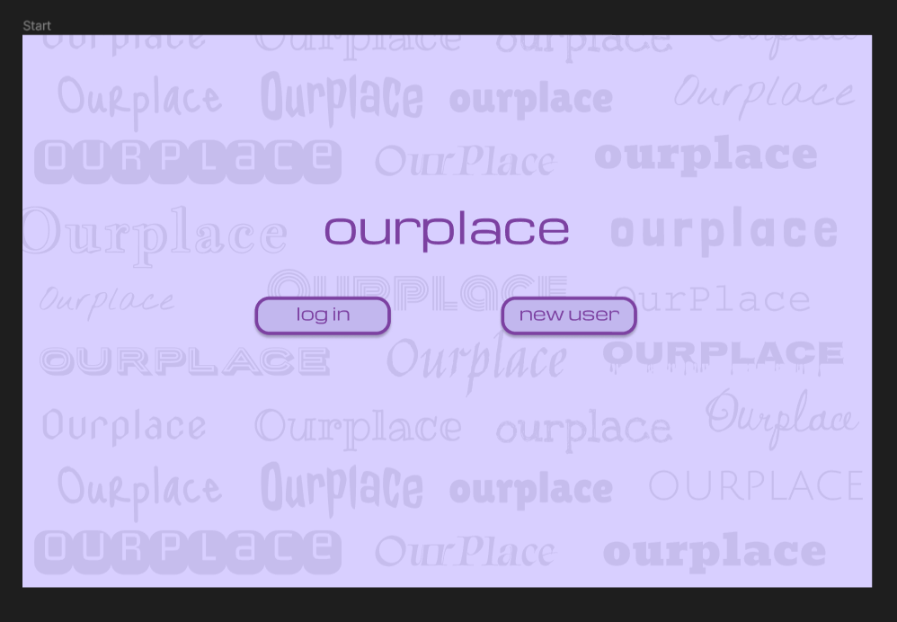

# Ourplace-app

## Describe what the app is about and what it is intended to do:
Ourplace is a forum app where users should be able to register a user/log in and read, write, and react to text posts from other users (or their own). The 'feed' should be sortable in two ways: by date - you see the newest posts first, or by the highest number of reactions (like clicks).

**Illustrative screenshots:**  
On the homepage, you can either log in or register a new user. \
 
After logging in, you can view the feed with posts. From here, you can log out, create a new post, or react to the posts in the feed. \

If you press the 'new post' button, this form will appear. You enter a title, the text for the post, and press 'post' to publish, or 'cancel' to go back to the feed without publishing. \
 

