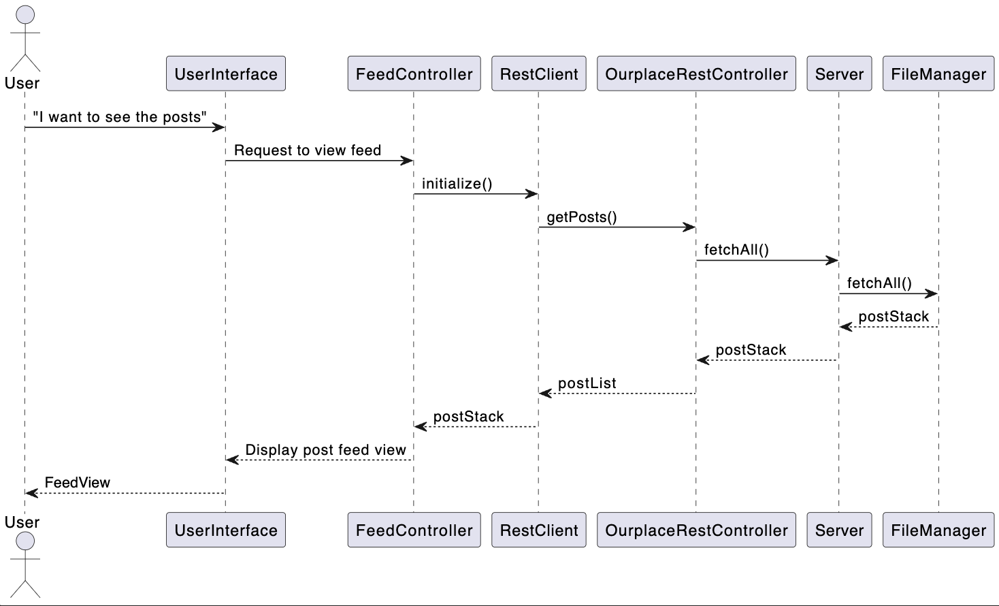

# Group gr2310 repository 

## Building and running the project

[Open in Eclipse che](https://che.stud.ntnu.no/#https://gitlab.stud.idi.ntnu.no/it1901/groups-2023/gr2310/gr2310?new)

We have used Maven to build and run our project.

##

### Run the App

From the gr2310 folder, open the terminal and run
```
bash ./setup.sh
```

This will run all the necessary
commands in the right order, and the app should open after roughly 3 seconds.

---
`If you prefer to get your hands dirty, follow the steps below:`

### Build
In the gr2310 folder, run the following command:
```
cd ourplace && mvn clean install
```
This will build the project without running the fxui tests, which require the server to already be running.

### Run the App
After building, you can (still in gr2310) run the following commands to start the **SpringBoot** server
```
cd ourplace/rest && mvn spring-boot:run
```
after the server has started up, run this, open a new terminal in gr2310
```
cd ourplace/fxui && mvn javafx:run
```

### Run with executable JAR
After successfully running the install command and starting the server, you can also run the app from the executable jar.

In the ourplace/fxui/target directory you'll find the `fxui-1.0-SNAPSHOT-jar-with-dependencies.jar` file. You can locate this file in the file explorer, and run the app by double clicking it. 

If a problem occurs, or you prefer to use the terminal you can also run this command from the gr2310 directory:
```
java -jar ourplace/fxui/target/fxui-1.0-SNAPSHOT-jar-with-dependencies.jar
```
You can also modify the filepath to run the command from any directory.

### Run Tests and Checks 
Unit tests and code checks are run during `mvn clean install`, but to run them separately, you can use this in gr2310/ourplace
```
mvn test
``` 
To check code quality and bugs, run these in gr2310/ourplace
```
mvn checkstyle:check
```
```
mvn spotbugs:check
```
You can see the Checkstyle and Spotbugs reports in the terminal, or in the target folder for each module. After running `mvn verify` you can also find test coverage **JaCoCo** reports in the target/site/jacoco of each module.

**_NOTE:_** The **SpringBoot** server must be _offline_ for the **RestClientTest** to run.

**_NOTE:_** Fxui tests are skipped by default, to run the fxui tests you can use the command `mvn verify -DskipTests=false` inside the fxui module to run the tests and generate the JaCoCo report. The **SpringBoot** server must be _online_, for the **AppTest** to run.

**_NOTE:_** For Mac users (probably just the latest versions) the fxui **AppTest** may cause problems when running the test.

# Diagrams
## Folder structure
Illustration of the folder structure in the project. 

```
└── ourplace
    └── client
        └── src
            └── main
                └── java
                    └── gr2310
                        └── ourplace
                            └── client

            └── test
                └── java
                    └── gr2310
                        └── ourplace
                            └── client
    └── core
        └── src
            └── main
                └── java
                    └── gr2310
                        └── ourplace
                            ├── core
                            └── json
            └── test
                └── java
                    └── gr2310
                        └── ourplace
                            ├── core
                            └── json
    └── docs
        ├── diagrams
        ├── img
        ├── release1
        ├── release2
        └── release3
    └── fxui
        └── src
            └── main
                └── java
                    └── gr2310
                        └── ourplace
                            └── ui
                └── resources
            └── test
                └── java
                    └── gr2310
                        └── ourplace
                            └── ui
    └── rest
        └── src
            └── main
                └── java
                    └──gr2310
                        └──ourplace
                            └──rest
            └── test
                └──java
                    └──gr2310
                        └──ourplace
                            └──rest
```
## Package diagram
[Package diagram](ourplace/docs/diagrams/architecture.puml) illustrating how the modules work together. 


## Class diagram
[Class diagram](ourplace/docs/diagrams/classDiagram.puml) illustrating the relations between the classes. The diagram depicts the main logic and server classes, which are the most important parts of the program. UI classes are omitted.
 

## Sequence diagram 
[Sequence diagram](ourplace/docs/diagrams/sequenceDiagram.puml) illustrating the sequence of calls from the user requesting the Feed.
 

# Project requires:
- Maven version 3.8.0
- Java version 9 or higher

**Other dependencies, to be downloaded by Maven:**
- JavaFX version 19
- JUnit version 4.13.2
- JUnit jupiter version 5.10.0
- Spotbugs version 4.7.3
- TestFX version 4.0.17
- Jackson version 2.15.2
- Spring-boot-starter-(test/web) version 3.1.5
- Wiremock version 3.0.1

As well as included transitive dependencies and plugins.

**Project README:** [Click here](ourplace/README.md)